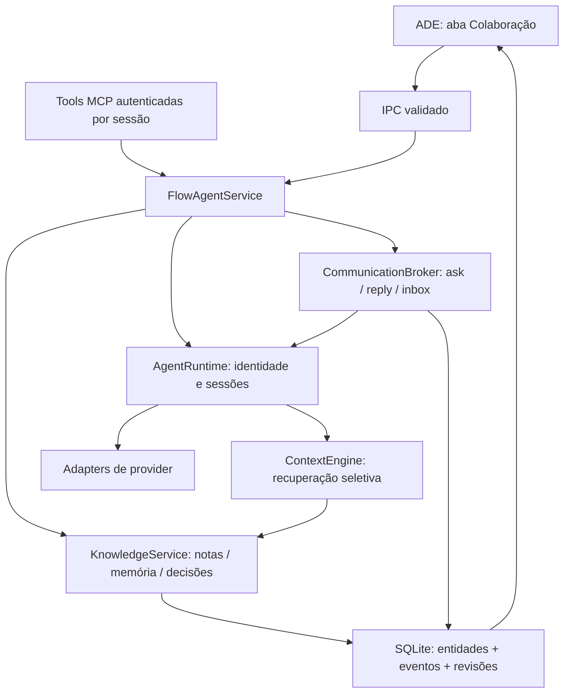

# Colaboração entre agentes

## Estrutura implementada

O protocolo pertence ao ADE, sem depender de um nome de CLI ou do provider. Reutiliza o `AgentRuntime`, o broker, o serviço de notas, o catálogo e o event store SQLite existentes. Não há outro banco ou event bus.

| Conceito | Identificador e função |
|---|---|
| Identidade | `agentId` estável. Pode ser reutilizado em outra tarefa depois de encerrar a execução anterior. |
| Perfil/role | Responsabilidades e permissões do agente. Não é sua identidade. `specialties` descreve competências declaradas; não concede permissões. |
| Sessão | `sessionId`, associado ao processo/conversa do provider. |
| Execução | `executionId`, separado da sessão; registra tarefa e worktree históricos. |
| Tarefa | `taskId`, unidade de trabalho do projeto. |
| Memória individual | Entidade `memory`, escopo `agent`, `ownerAgentId`. Sobrevive a sessões e tarefas. |
| Memória do projeto | Regras/contexto globais explicitamente criados pelo usuário ou Maestro. |
| Histórico bruto | Eventos de output/conversação existentes. Não se tornam memória automaticamente. |

A interface de lançamento permite selecionar uma identidade existente, mantendo provider e role compatíveis. Participantes de tarefas anteriores são derivados das execuções históricas; seus controles não comandam a sessão nova. Sessões legadas continuam legíveis, inclusive quando usavam o mesmo ID para sessão e execução.

Uma futura memória por perfil poderá ser acrescentada como outro escopo de recuperação, sem substituir `ownerAgentId`. A camada de Skills não foi implementada.

## Comunicação

`ask` cria uma mensagem durável antes de chamar o provider. `reply(messageId, response)` é a única operação que conclui uma pergunta. Output público, conclusão de turno e `wait_agent` não são respostas correlacionadas.

Cada mensagem inclui `messageId`, `correlationId`, origem, destino, execuções, tarefa, referências, prazo, profundidade, estado e revisão. Perguntas chegam diretamente ao destinatário; o Maestro pode observar o histórico, mas não encaminha cada interação.

Estados: `queued → delivery_uncertain → delivered → responded`, além de `timed_out`, `cancelled` e `failed`. Destinatários ocupados recebem mensagens na fila quando o runtime observa disponibilidade. Providers sem follow-up produzem falha explícita. A intenção de entrega é registrada antes da operação externa.

Limites atuais: 8.000 caracteres por mensagem, prazo padrão de 120 segundos (1–600 segundos), dez perguntas abertas por solicitante, cinquenta perguntas por execução e profundidade máxima quatro. Ciclos de espera e autochamadas são rejeitados. Respostas de outra identidade, de outra execução ou depois do prazo são rejeitadas. Encerrar uma sessão cancela/falha suas interações pendentes. O encerramento do broker limpa timers, esperas e subscriptions.

Após reiniciar, perguntas ainda na fila tornam-se falhas e entregas em andamento ficam incertas, com motivo auditado. Não há reenvio automático: SQLite e provider externo não compartilham uma transação. Uma nova tentativa deve ser explícita, como nova pergunta. `operationId` permite repetir a criação sem duplicá-la; reutilizar o ID com outro conteúdo é rejeitado.

Tools: `list_agents`, `inspect_agent`, `ask_agent`, `ask_agent_async`, `reply_agent`, `list_inbox`, `get_interaction`, `wait_reply`, `cancel_question`, `send_message`, `broadcast`. `ask_agent` aguarda resposta explícita; a versão assíncrona retorna recibo e permite consultar a inbox depois. Não existem nomes especiais obrigatórios para os agentes; chamadas usam IDs obtidos pela descoberta.

## Conhecimento persistente

Notas, memória e decisões são entidades distintas com política comum de autoria, acesso, revisão, relações e eventos. Referências podem apontar para execução, tarefa, agente, arquivo relativo à worktree, commit, artefato, decisão, nota ou mensagem. Caminhos que escapam da worktree e referências de outro projeto são rejeitados.

### Notas

`create_note` permite a agentes criar orientações para outros agentes do mesmo projeto. O autor pode editar; destinatários podem ler, reconhecer e resolver. O usuário e o Maestro administram compartilhamento e arquivamento. Escritores adicionais são concessões explícitas. Não há exclusão física do histórico.

Estados: `ACTIVE`, `ACKNOWLEDGED`, `RESOLVED`, `SUPERSEDED`, `ARCHIVED`. Reconhecimento/resolução são individuais quando há vários destinatários. A nota muda de estado agregado depois que todos fazem a ação. Resolver exige reconhecimento prévio.

Criações equivalentes ativas do mesmo autor/escopo/destinatários são deduplicadas. Novas relações de tarefa podem ser associadas à nota existente. Substituir exige outra nota ativa com escopo e destinatários compatíveis, e registra ambas as alterações atomicamente. `expectedRevision` evita sobrescritas concorrentes.

Tools: `create_note`, `read_note`, `list_notes`, `update_note`, `transition_note`, `link_note`, `share_knowledge`.

### Memória

`create_memory` registra conhecimento explícito do agente; `category` distingue regra, finding e contexto. A memória individual é privada por padrão, vinculada ao `agentId`. O usuário/Maestro pode administrá-la ou conceder acesso. Um agente não pode criar memória individual para outra identidade nem publicar regras globais sem autorização.

Tools: `create_memory`, `list_memory`, `update_memory`, `transition_memory`. Expiração (`validUntil`), arquivamento e substituição impedem recuperação de entradas antigas. Não há sumarização automática nem gravação automática de conversas como conhecimento.

### Decisões

Agentes propõem decisões do projeto. Um Reviewer diferente do autor pode validar. O usuário pode aceitar com justificativa; o Maestro pode aceitar depois de validação independente. Developers não aceitam decisões. Alterar uma proposta invalida suas validações anteriores.

Decisões aceitas não podem ser editadas silenciosamente. Uma proposta nova pode substituir uma decisão aceita; aceitação e supersessão são gravadas em uma transação. Estados: `proposed`, `accepted`, `rejected`, `superseded`, `archived`.

Tools: `propose_decision`, `list_decisions`, `update_decision`, `transition_decision`.

## Recuperação seletiva

Antes do início e dos follow-ups, o runtime recupera somente conhecimento autorizado e vigente:

1. Notas ativas/reconhecidas, memória ativa e decisões aceitas.
2. Relações exatas com tarefa/arquivos, regras universais do projeto, tags e correspondência textual.
3. Prioridade e atualização como desempate.
4. No máximo doze registros e 12.000 caracteres de conhecimento. O prompt final respeita os limites atuais do adapter: 16.000 no início e 8.000 no follow-up.

Regras universais que não cabem no orçamento causam erro explícito para que sejam consolidadas; não são omitidas silenciosamente. `context.selected` registra IDs, revisões, motivos e quantidade omitida. O bloco recuperado é apresentado como dados de referência, sem autoridade para substituir instruções ou permissões.

O mecanismo atual é determinístico e lexical. SQLite foi escolhido pela infraestrutura existente, transações, backup e auditoria locais. Markdown permanece útil como documento relacionado, mas não é a fonte de estado concorrente. Arquivos estruturados exigiriam implementar novamente revisões/transações. Memória vetorial poderá melhorar relevância sem mudar a política de autorização/estado; hoje não há embeddings ou dependência externa. Informação contraditória exige substituição explícita e revisão humana/agente; o motor não declara automaticamente qual texto é verdadeiro.

## Fluxos

- **A:** Maestro atribui uma responsabilidade → Frontend cria `ask` para Reviewer → Reviewer usa `reply_agent` com o ID recebido → Frontend obtém a resposta → conclui a responsabilidade; eventos registram as identidades e execuções.
- **B:** Product cria nota direcionada → Frontend reconhece com revisão → implementa → resolve a nota com a nova revisão.
- **C:** Reviewer cria nota para Backend → Backend pergunta com referência à nota → Reviewer responde ao ID → Backend registra resultado/conclui responsabilidade.

Os três cenários estão cobertos por testes de runtime. A inbox permite recuperar recibos/respostas sem reconstruir todo o histórico.

## Persistência, segurança e interface

Migração v2 amplia o CHECK de `entities` com `message` e `memory` e acrescenta índices de proprietário/escopo/inbox. Reutiliza `events`, `entities`, revisão otimista e ordenação canônica. Publicação ocorre depois do commit; batches falhos não publicam eventos nem deixam projeções parciais. Eventos de conhecimento incluem conteúdo anterior e novo para auditoria de alterações.

Backups v1 são validados contra seu schema e migrados para v2 durante restore. Backups novos incluem mensagens, notas, decisões e memória. Downgrade destrutivo com entidades novas é recusado. Notas legadas sem autor permanecem identificadas como `legacy/unknown`; não recebem autoria inventada ou acesso indiscriminado.

O MCP local usa token e autorização vinculados à sessão ativa. Identidade e projeto vêm do servidor, nunca de campos fornecidos pelo agente. Credenciais de sessão encerrada são recusadas. IPC tem operações/estruturas permitidas e limites de tamanho.

A aba **Colaboração** da execução apresenta histórico paginado, relações ASK/REPLY/NOTE, detalhes de pergunta/resposta/contexto/arquivos/execuções/horário, conhecimento relacionado e registro de notas, memória individual e propostas. O usuário pode aceitar decisões ou arquivar registros. A infraestrutura de eventos permite ampliar o grafo sem reinterpretar output textual.

## Providers e verificação

- **OpenCode:** integração ACP e MCP, tools ADE fornecidas a todos os roles. A política limita operações por role, sem depender da autorização do provider.
- **Codex:** execução/output/stop existentes preservados. O adapter atual declara follow-up sem suporte e MCP não negociado; o ADE informa essas limitações e não simula uma conversa correlacionada pelo output.

Testes cobrem correlação, concorrência, fila, prazo, ciclos, identidade, autorização, revisões, decisões, contexto, reuso de identidade, shutdown/restart, migração/backup, MCP, IPC, UI e persistência Electron. Adapters usam fixtures locais. Nenhuma chamada a modelo remoto foi feita para validar esta entrega.

Comandos: `npm run build`, `npm run test:node`, `npx vitest run`, `npx playwright test`.
