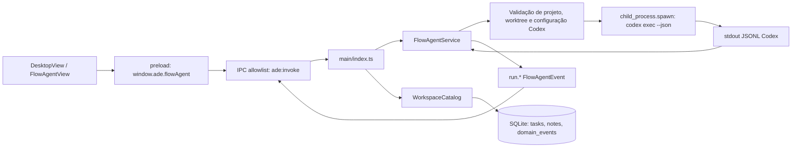
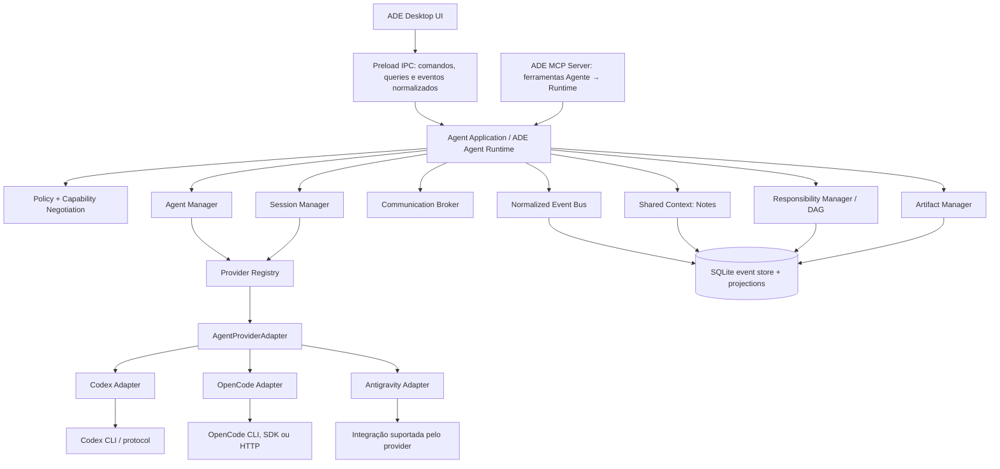

# Plano de arquitetura: runtime multi-provider de agentes

**Status:** análise e proposta; nenhuma implementação feita nesta etapa  
**Escopo:** runtime de agentes, integrações de provider, comunicação, dados compartilhados e UI operacional  
**Base inspecionada:** `src/main`, `src/preload`, `src/shared`, `src/domain`, `src/renderer`, `tests` e documentos de arquitetura existentes

## Resumo executivo

A ADE já tem bons limites de segurança entre renderer e processo principal e uma base SQLite com snapshots de entidades, revisões e eventos ordenados. Porém, a integração executável atual não passa pelo adapter: `FlowAgentService` resolve o binário Codex, valida sua configuração, compõe argumentos do CLI, cria um processo filho, interpreta JSONL do Codex, controla cancelamento e determina o resultado. O adapter chamado `CodexAdapter` é somente um detector passivo de presença e declara as capacidades de execução como não suportadas.

A UI ativa é `DesktopView`. Ela mistura tarefas do catálogo real com cartões e uma sessão multi-agent demonstrativos (`taskCards` e `demoSession`); seus controles de pausa e cancelamento apenas alteram estado local. O backend atual executa uma tarefa Codex de cada vez por worktree. Não existe Agent Manager, Session Manager persistente, broker de comunicação, grafo de agentes ou servidor MCP da ADE.

A migração recomendada tem duas trilhas coordenadas:

1. **Verdade na UI:** remover imediatamente os dados e controles demonstrativos, exibir somente dados do catálogo/execuções reais e representar “não disponível” quando o backend não oferece uma sessão multi-agent.
2. **Boundary de runtime:** encapsular a execução existente sem mudar seu comportamento em um `CodexProviderAdapter`; então introduzir identidade lógica, sessões, tentativas, eventos normalizados e capabilities antes de adicionar um segundo provider.
3. **Prova funcional:** antes de investir na orquestração automática ou ampliar a UI multi-agent, demonstrar o ciclo real Maestro → Developer → Reviewer → Developer → Tester com mensagens, espera, eventos e artefatos observáveis.

MCP deve entrar primeiro na direção **agente → ADE Runtime**, como uma superfície de ferramentas controlada pelo runtime. Para **ADE Runtime → agente**, usar o protocolo de integração nativo de cada provider — CLI, SDK ou HTTP — e considerar MCP client somente quando um provider específico expuser uma interface de agente MCP documentada.

## 1. Estado atual da arquitetura

### Fluxo de execução observado



`FlowAgentService.start()` valida o projeto Git, encontra a worktree, resolve referências relativas, bloqueia uma segunda execução na mesma worktree e agenda `codex exec --json`. A execução usa `stdio: ['ignore','pipe','pipe']`; **não existe PTY**, o `stdin` do filho é ignorado e não há escrita de prompt posterior. A instrução inteira vai como argumento do processo. `stdout` é tratado como JSONL específico do Codex e só mensagens de agente são convertidas em `run.output` textual. `stderr` é contabilizado e descartado; exceder o limite marca erro e encerra o processo.

O status começa internamente como `running` antes do spawn, embora `start()` retorne `queued`. O runtime em memória mantém sequência, buffer, listeners e até 256 eventos para cada run; retém no máximo 100 runs concluídos. Não há consulta/listagem durável de sessões ou de runs após reinício. O catálogo persiste a tarefa e atualiza seu status por callback, mas não persiste o snapshot da sessão nem a sequência de eventos do run.

O processo é considerado bem-sucedido quando fecha com exit code zero, não há erro de processo/protocolo, falha de turno ou cancelamento. O silêncio de `stdout`, isoladamente, **não** conclui o agente. Ainda assim, o contrato atual trata qualquer fechamento limpo do processo como sucesso, e não mantém um estado separado de “turno concluído pelo provider”. Cancelamento tenta matar a árvore do processo: `taskkill /T /F` no Windows; grupo de processos com `SIGTERM`/`SIGKILL` nos demais sistemas.

### Arquivos e acoplamentos encontrados

| Arquivo / componente | Responsabilidade atual | Acoplamento ou limite | Boundary sugerido |
|---|---|---|---|
| [`src/main/orchestration/flow-agent-service.ts`](../../src/main/orchestration/flow-agent-service.ts) | Projeto/worktree, descoberta e validação do Codex, configuração, spawn, JSONL, output, status, histórico, cancelamento, cleanup | É simultaneamente serviço de aplicação, launcher Codex, parser de protocolo, event bus e controlador de processo. Usa `findCodex`, `CODEX_HOME`, `config.toml`, `codex exec`, `--json`, `--sandbox` e modelo Luna. | Extrair o comportamento atual, sem alteração semântica, para `CodexProviderAdapter`; deixar no runtime política, identidade, autorização, status/eventos normalizados, sessões e coordenação. Mover checagens de caminho/worktree para serviços de workspace/policy reutilizáveis. |
| [`src/main/adapters/codex/codex-adapter.ts`](../../src/main/adapters/codex/codex-adapter.ts) | Detecta nomes de executável no `PATH`; devolve disponibilidade, autenticação desconhecida e capacidades | `AgentAdapter` é local/provisório, provider-specific nos tipos e não executa sessão. `createSession`, `resumeSession`, `sendTask`, `streamEvents`, `cancel` e `terminate` são marcadas `unsupported`. Não está ligado ao fluxo de execução. | Preservar detecção como `ProviderDiscovery`/`ProviderDetector`; criar o contrato executável comum independente. Não ampliar esse tipo provisório por compatibilidade nominal. |
| [`src/main/index.ts`](../../src/main/index.ts) | Cria lazy `FlowAgentService`, conecta conclusão à tarefa, roteia operações IPC, protege sender, mantém subscriptions e shutdown | Main escolhe diretamente `FlowAgentService`; os cases são `flowAgent.*`; conclusão escreve status do catálogo. `requestId` também serve como `taskId`. | Tornar o main um composition root: registrar adapters, construir `AgentRuntime` e delegar operações de domínio. Manter validação de IPC e lifecycle de aplicação aqui; não inserir lógica de provider nos cases. |
| [`src/shared/contracts/ipc.ts`](../../src/shared/contracts/ipc.ts) | DTOs e validação de requests/responses/eventos de workspace e execução | `FlowAgentProfile`, `FlowAgentRunSnapshot`, `run.output` e todos os eventos codificam “run Codex de um perfil” em vez de agente lógico/provider/sessão. Renderer importa o snapshot do serviço. | Manter DTOs IPC serializáveis e versionados, mas trocar para comandos/queries do domínio: criar/listar/inspecionar agente, sessão e execução; assinar `RuntimeEvent` normalizado. |
| [`src/preload/index.ts`](../../src/preload/index.ts) | Exposição segura de operações nomeadas e filtro de eventos por `projectId/runId` | API pública só conhece `flowAgent` e `workspace`; a chave de subscription é project + run. | Adaptar os métodos nomeados para `agentRuntime`/`sessions`; filtrar por sessão/agente/projeto e remover listeners de forma determinística. Não expor `ipcRenderer`, processo ou API MCP genérica ao renderer. |
| [`src/main/workspace-catalog.ts`](../../src/main/workspace-catalog.ts) | Persiste projects/tasks/notes e converte eventos para o catálogo | Tasks carregam `runId`; notas são só `title/body`; não guarda agent, session, execution, vínculo, capabilities, links ou permissões. No startup marca `running/queued` como `interrupted`. | Introduzir repositórios de agente/sessão/responsabilidade/nota com migração aditiva. Distinguir sessão recuperável de tentativa de execução interrompida. |
| [`src/main/persistence/sqlite-store.ts`](../../src/main/persistence/sqlite-store.ts) | Event store SQLite com revisão otimista, idempotência de `eventId`, sequência por projeto, snapshot e replay | Já oferece fundação durável, mas só é consumido pelo catálogo atual. O evento durável proíbe campos/chaves relacionados a stdout, stderr, PTY, terminal, transcript e output. | Reutilizar sequência, revisão, `commit`, snapshot/replay e validação. Manter stream bruto efêmero e persistir somente eventos normalizados explícitos e conteúdo permitido; versionar esquema. |
| [`src/main/persistence/migrations.ts`](../../src/main/persistence/migrations.ts) e [`src/domain/model.ts`](../../src/domain/model.ts) | Schema v1: entidades já lista `agent`, `agentProfile`, `task`, `session`, `execution`, `note`, `decision`, `approval`, `evidence` | A tabela `entities` aceita esses tipos, mas entidades e payloads são genéricos. Não há `responsibility`, relações de notas, `providerSession`, attempt, capabilities ou grants. Não há tabela de relações. | Fazer migração aditiva (v2+) e definir aggregates/índices para relações e lookups antes de ligar persistência do runtime. Não é necessário substituir o event store. |
| [`src/domain/entities.ts`](../../src/domain/entities.ts) | Estruturas básicas `AgentData`, `SessionData`, `ExecutionData`, `NoteData` etc. | `AgentData.adapterId` dá sinal de provider, mas `SessionData.agentId/status/resumable/providerSessionId` é mínimo e não separa attempt/process/terminal. Note só tem título e corpo. | Evoluir os payloads com contratos de domínio explícitos e migrações; manter `Agent` como identidade lógica e provider-session/process como referências distintas. |
| [`src/shared/contracts/domain.ts`](../../src/shared/contracts/domain.ts) | Sanitiza segredos, valida JSON, metadados de Evidence e rejeita eventos duráveis de terminal/output | É uma barreira de segurança importante. Um transcript ou `agent.output` livre não pode ser persistido indiscriminadamente como evento comum. | Preservar a política. Definir allowlist de campos/eventos duráveis e separação entre feed transitório, resumo redigido e `Evidence` metadata. |
| [`src/renderer/main.tsx`](../../src/renderer/main.tsx), [`src/renderer/views/FlowAgentView.tsx`](../../src/renderer/views/FlowAgentView.tsx) | `main.tsx` monta `DesktopView`; `FlowAgentView` é outra tela que usa API FlowAgent | A tela FlowAgent nomeia Codex diretamente no cabeçalho, instrução, output, progress e labels. Não é a entrada renderer atual, mas continua acoplada e pode voltar a ser usada. | Fazer as views consumirem projeções do runtime e capability-aware UI, sem nomes/protocolos de provider exceto em detalhes de diagnóstico. |
| [`src/renderer/views/DesktopView.tsx`](../../src/renderer/views/DesktopView.tsx), [`src/renderer/multi-agent/session.ts`](../../src/renderer/multi-agent/session.ts), [`src/renderer/components/MultiAgentPanel.tsx`](../../src/renderer/components/MultiAgentPanel.tsx) | Tela ativa: carrega tarefas e notas; painel mostra agentes, conversas, arquivos e eventos de exemplo | `demoSession`, `taskCards`, branch/login fictício, event/message fixtures e handlers locais de pause/cancel. Cartões de demo são mesclados às tarefas reais; pause/cancel não chamam runtime. Isso não representa sessões reais. | Remover fixtures e callbacks simulados primeiro. Alimentar componentes por queries/subscriptions reais; quando não houver session/agent event, exibir vazio/indisponível, sem inventar status. UI multi-provider lê `capabilities` e estado do runtime. |
| [`src/renderer/mocks/operationalList.fixtures.ts`](../../src/renderer/mocks/operationalList.fixtures.ts), [`src/renderer/views/OperationalListView.tsx`](../../src/renderer/views/OperationalListView.tsx) | Projeção demonstrativa com Codex/OpenCode e estados sintéticos | Consumida pela prévia isolada `operational-preview.html`; rotula dados desconectados e contém callout de simulação. Não é a UI principal, mas não deve ser confundida com dados reais. | Manter claramente isolada como artefato visual ou retirar da distribuição operacional. Não conectar fixture a runtime nem tratá-la como presença/capability observada. |
| [`docs/architecture/ADE-106-codex-detection.md`](./ADE-106-codex-detection.md) | Registra que o detector Codex é passivo e que seu contrato é provisório | Explicitamente pede que não seja ligado a IPC, persistência ou domínio antes do contrato comum. | Rever essa decisão com este plano como proposta; até a decisão, manter o detector isolado. |

### O que existe e o que não existe

- **Existe:** execução Codex one-shot via `codex exec`; profiles `developer`/`reviewer` traduzidos a `workspace-write`/`read-only`; descoberta defensiva de binário e validação do arquivo `config.toml`; worktree e referências validadas; eventos in-memory sequenciados; cancelamento de processo; task/note persistidos; IPC allowlisted; event store com replay/snapshot; detecção passiva isolada de Codex.
- **Não existe:** PTY, envio de mensagens depois do início, sessão provider resumível, cadastro executável de agentes, provider registry, capability negotiation comum, estado `ready/waiting/blocked`, eventos de arquivo/comando/tool normalizados, vários agentes por task, broker, notas vinculadas/permissões, responsibilities/DAG, MCP server/client de runtime, recuperação de sessão após reinício.

## 2. Os cinco principais problemas arquiteturais

1. **Implementação e protocolo Codex no mesmo serviço.** `FlowAgentService` detém quase todo o ciclo, inviabilizando um segundo provider sem condicional/provider leak.
2. **Identidade, sessão, tentativa e processo não se distinguem.** `runId` vira referência para UI/task; processo filho é campo interno; a sessão não sobrevive a restart.
3. **Eventos são um contrato específico e efêmero.** `run.output` é texto de mensagem Codex; file/tool/review/test/agent events não são representados e subscribers perdem dados no shutdown.
4. **O modelo persistente não é usado pelo runtime.** O schema já reserva `agent/session/execution`, mas o catálogo grava principalmente task/note. Sem persistência do run não se pode reinspecionar ou retomar.
5. **O painel multi-agent atual é demonstrativo.** A tela apresenta colaboração, handoffs, tarefas e estado que o backend não produz; isso pode sugerir falsamente execução real.

## 3. Arquitetura alvo



O **runtime** é proprietário do modelo de domínio e da política. Ele não cria diretamente `ChildProcess`, não entende JSONL do Codex e não assume que um provider tenha terminal, streaming, resume ou subagents. O **adapter** é dono da tradução para a integração concreta e das suas limitações. Um `ProcessController`/`TerminalTransport` pode existir dentro do adapter CLI, sem se tornar a abstração comum.

### Entidades e ownership

```text
Agent (identidade lógica, agentId estável, providerId, role, grants)
  └── ProviderSession (sessionId ADE, providerSessionId opcional)
        └── ExecutionAttempt (attemptId, retry/restart, timestamps, resultado)
              └── ProcessHandle? (PID, exit code, sinal; detalhes efêmeros)
                    └── TerminalTransport? (stdio/PTY; capability do adapter)
```

Tasks atribuem `Responsibility` a um ou mais `Agent`; cada responsabilidade pode depender de outras. `ProviderSession` é a conversa/sessão externa quando o provider possui conceito correspondente. `ExecutionAttempt` representa uma tentativa de iniciar/enviar/retomar. Um PID ou PTY nunca é a identidade do agente e não deve ser exigido por SDK/API providers.

O **Maestro** é um papel de coordenação, não um tipo privilegiado de provider nem uma classe especial de processo. Ele recebe grants delegados como `agent.create`, `agent.communicate`, `responsibility.assign` e `note.write`; um Developer comum não recebe esses grants por padrão. Uma futura skill do Maestro pode descrever ferramentas e regras de uso, mas a autorização efetiva permanece no runtime e não na instrução de prompt.

## 4. ProviderAdapter proposto

O contrato deve ser pequeno, assíncrono, versionado e expor operações sem detalhes de CLI. `create()` cria uma sessão remota/local; `start()` envia a instrução inicial; `send()` envia mensagem subsequente se suportado. `resume()` só existe como capacidade negociada. Cada chamada pode aceitar `AbortSignal` e deadline, e cada assinatura precisa ser descartável.

```ts
type Support = 'supported' | 'unsupported' | 'conditional' | 'unknown';
interface AgentCapabilities {
  terminal: Support; streaming: Support; mcpClient: Support; fileEditing: Support;
  toolCalling: Support; sessionResume: Support; structuredEvents: Support;
  interrupt: Support; sendMessage: Support; subagents: Support;
  structuredOutput: Support; filesystem: Support; shell: Support;
}
interface ProviderContext {
  agentId: string; projectId: string; worktreeId?: string;
  role: string; permissionGrantId: string; signal: AbortSignal;
}
interface CreateProviderSessionInput {
  instructions: string; model?: string; options?: JsonObject;
}
interface ProviderSessionRef {
  providerId: string; providerSessionId: string | null; resumable: boolean;
  transport: 'stdio' | 'pty' | 'http' | 'sdk' | 'mcp' | 'none';
}
interface ProviderError {
  kind: 'unavailable' | 'unsupported' | 'authentication' | 'policy' | 'timeout' |
    'cancelled' | 'protocol' | 'process-exit' | 'rate-limit' | 'unknown';
  message: string; retryable: boolean; providerCode?: string;
}
interface AgentProviderAdapter {
  readonly providerId: string;
  getCapabilities(context?: ProviderContext): Promise<AgentCapabilities>;
  create(input: CreateProviderSessionInput, context: ProviderContext): Promise<ProviderSessionRef>;
  start(session: ProviderSessionRef, input: CreateProviderSessionInput, context: ProviderContext): Promise<void>;
  send(session: ProviderSessionRef, message: AgentInput, context: ProviderContext): Promise<void>;
  interrupt(session: ProviderSessionRef, context: ProviderContext): Promise<void>;
  stop(session: ProviderSessionRef, context: ProviderContext): Promise<void>;
  resume(session: ProviderSessionRef, context: ProviderContext): Promise<ProviderSessionRef>;
  getStatus(session: ProviderSessionRef, context: ProviderContext): Promise<ProviderObservation>;
  subscribe(session: ProviderSessionRef, listener: (event: ProviderObservationEvent) => void,
    context: ProviderContext): Unsubscribe;
  dispose?(): Promise<void>;
}
```

`AgentInput` deve conter instrução/mensagem e referências seguras ao contexto, não `ChildProcess`, `Buffer` ou caminho arbitrário. Adapter pode rejeitar método com `unsupported` se capability for negativa. `create()` e `start()` devem permanecer separados para possibilitar validar/gravar identidade e sessão antes do side-effect externo. Se a integração não tem sessões, um provider one-shot pode criar uma ref local com `providerSessionId: null`; runtime ainda terá Agent e attempt.

**Erros, timeout e cancellation:** operação recebe `AbortSignal`; timeout é convertido em erro `timeout`, e cancelamento solicitado pelo usuário é distinto de timeout/falha. O runtime mantém deadline e idempotency/correlation ID, cancela setup mesmo antes de spawn e só considera operação fechada quando adapter reporta encerramento/`getStatus` terminal ou timeout de encerramento é marcado como `unresponsive`. Não deixar uma Promise de cancelamento indefinidamente pendente. Erros públicos são tipados e redigidos; stderr/raw provider payload não sobe pela API comum.

**Streaming:** `subscribe()` entrega observações tipadas, sem prometer que todo provider emite tokens. `streaming: unsupported` não impede inspeção por polling. Adaptador converte chunks parciais em `agent.output` ephemeral e resultados finais em eventos estruturados quando disponíveis. `subscribeOutput()` e `subscribeEvents()` podem ser conveniences no adapter, mas a API de aplicação é uma assinatura normalizada por `RuntimeEvent`.

### CodexAdapter inicial

Na primeira extração, envolver o `codex exec --json` atual. Preservar argumento/sandbox, validação de `PATH` e config, limites JSONL/output, redaction e kill-tree. O adapter informa capability real de uso **nesta versão e contexto**; não copiar como capabilities de todos os Codex futuros. O detector ADE-106 continua separado da criação da sessão. Não declarar resume/send/terminal como suportados sem verificar uma interface Codex estável para essas operações.

## 5. AgentRuntime proposto

API para UI e orquestração chama o domínio, nunca o adapter diretamente:

```ts
interface AgentRuntime {
  createAgent(input: CreateAgentInput, principal: Principal): Promise<AgentRecord>;
  listAgents(filter: AgentFilter, principal: Principal): Promise<AgentRecord[]>;
  inspectAgent(agentId: string, principal: Principal): Promise<AgentInspection>;
  startAgent(agentId: string, input: StartAgentInput, principal: Principal): Promise<ProviderSessionRecord>;
  sendMessage(input: SendAgentMessage, principal: Principal): Promise<MessageReceipt>;
  askAgent(input: AskAgentInput, principal: Principal): Promise<AgentResponse>;
  waitForAgent(input: WaitForAgentInput, principal: Principal): Promise<AgentInspection>;
  connectAgents(input: ConnectAgentsInput, principal: Principal): Promise<AgentConnection>;
  disconnectAgents(connectionId: string, principal: Principal): Promise<void>;
  interruptAgent(agentId: string, principal: Principal): Promise<void>;
  stopAgent(agentId: string, principal: Principal): Promise<void>;
  resumeAgent(agentId: string, principal: Principal): Promise<ProviderSessionRecord>;
  getCapabilities(agentId: string, principal: Principal): Promise<AgentCapabilities>;
  subscribe(filter: RuntimeEventFilter, listener: RuntimeEventHandler): Unsubscribe;
}
```

Responsabilidades do runtime: verificar principal/grants, capabilities, worktree e contexto; alocar IDs lógicos; gravar transições e correlation IDs; selecionar adapter via registry; chamar lifecycle com timeout/signal; validar dependências e isolamento de gravação; converter `ProviderObservationEvent` para evento interno; atualizar projections; expor queries. A UI recebe `AgentInspection` que combina identidade, capability observada, última observação e status normalizado. Runtime não passa reasoning privado, env, caminho de segredo ou payload bruto à UI.

`createAgent({provider, role})` cria uma **identidade/configuração**, não precisa iniciar processo. `startAgent` abre sessão/tentativa e aceita tarefa/contexto. Esse split facilita permissões, auditoria, reinício e preparar um grafo antes de executar.

Um `AgentContextBuilder` deve compor, antes de cada início ou continuação, role/system instructions, contexto permitido do projeto e worktree, tarefa/responsabilidade, notas linkadas, mensagens relevantes e ferramentas autorizadas. Ele entrega uma entrada pronta ao adapter sem deixar construção de prompt espalhada no renderer, IPC, broker e providers. O conteúdo incluído é limitado por grants, tamanho e redaction; contexto privado de outro agente não é herdado automaticamente.

## 6. Capability model e negociação

Capability é observação declarada pelo adapter e condicionada por contexto, versão, auth e policy; não é autorização. Use `supported/unsupported/conditional/unknown`, mais `reasonCode` opcional e `observedAt`, em vez de assumir `true` por provider. Cache deve ter TTL e invalidar quando executável/versão/config muda.

Negotiation proposta:

1. Adapter detecta integração e versão sem coletar credenciais; capability estática/condicional é calculada.
2. Runtime intersecta capabilities com policy local (ex.: provider suporta shell, mas principal não recebeu grant shell).
3. UI anuncia controles somente quando a operação é suportada e autorizada; capability desconhecida resulta em indisponível/investigar, nunca em botão que falha silenciosamente.
4. Todo comando revalida capability, sessão, policy e contexto; UI não é autoridade.
5. Para colaboração, runtime expõe a outros agentes somente capability pública permitida (providerId, roles e operações), não token, PID ou config.

Terminal, filesystem, shell, git, MCP client/server, streaming, tool calling, subagents, structured output, send, interrupt, resume e structured events são capabilities separadas. Uma capability `terminal` não implica shell autorizado; `mcpClient` não significa que MCP controla o provider-session.

## 7. Lifecycle e status normalizados

Estados canônicos solicitados: `created → starting → ready → running → waiting/blocked → running → completed|failed|stopped`; `unresponsive` é condição operacional recuperável e pode retornar a `ready/running` após heartbeat. Guardar também `desiredState` (ex.: stop solicitado) e `observedState` para não confundir comando emitido com resultado confirmado.

| Fonte de evidência | O que informa | O que não deve significar sozinha |
|---|---|---|
| Processo spawn/error/close e exit code | Existência e saúde do launcher CLI | Que o trabalho semântico acabou ou teve sucesso |
| Evento/protocolo explícito de conclusão do provider | Turno/sessão concluiu, falhou ou aguarda input | Que o processo já foi encerrado |
| Heartbeat/poll de provider-session | Última resposta e vivacidade | Sucesso ou conclusão do turno |
| Atividade PTY/stdout | Há I/O recente | `running` semântico; ausência de I/O não é completion |
| Mensagem/evento do runtime | pedido recebido, cancelamento desejado, handoff | que o provider confirmou a transição |

Conclusão precisa de evidência positiva conforme o contrato do adapter: evento final estruturado, status terminal obtido de `getStatus`, ou para um comando one-shot explicitamente documentado, fechamento limpo + exit code zero + ausência de erro de protocolo/turno. Sem evidência confiável, status vira `unresponsive`/`unknown` ou falha de protocolo, não `completed`. Para Codex atual, o fechamento do processo e exit code fazem parte do contrato observado; preservar esse comportamento na fase de extração e endurecer semântica ao adicionar protocolo/evento explicitamente verificável.

Reinício cria novo `ExecutionAttempt` no mesmo `Agent` lógico. Reusar `ProviderSession` apenas se capability `sessionResume` e o provider confirmar referência válida; caso contrário abrir nova sessão e registrar `restartedFrom/previousSessionId` permitido. Não inferir que processo com mesmo PID ou worktree é mesma sessão.

## 8. Eventos normalizados

Use envelope comum versionado:

```ts
interface RuntimeEvent<T = JsonObject> {
  eventId: string; schemaVersion: number; projectId: string; sequence: number;
  occurredAt: string; receivedAt: string; correlationId: string;
  agentId?: string; sessionId?: string; attemptId?: string;
  type: RuntimeEventType; source: 'runtime' | 'provider' | 'user' | 'system';
  data: T; persistence: 'durable' | 'ephemeral';
}
```

Famílias internas: `agent.created|starting|ready|waiting|blocked|completed|failed|stopped|unresponsive`; `session.created|started|resumed|ended`; `agent.output` (efêmero e policy-filtered); `agent.action.started|completed|failed`; `task.delegated`; `message.sent|delivered|response.received`; `agent.connected|disconnected`; `responsibility.created|assigned|transferred|completed`; `note.created|updated|linked`; `file.read|created|modified|deleted`; `command.started|completed|failed`; `tool.called|completed|failed`; `review.started|comment`; `test.started|passed|failed`; `artifact.created`; `git.commit|merge|conflict`; `provider.capabilitiesObserved`; `provider.protocolError`.

Adapter emite `ProviderObservationEvent` versionado e específico; `ProviderEventNormalizer` converte, valida, redige e associa ids/correlation. Preservar `providerType/providerEventId` apenas como metadata opaca limitada para diagnóstico, sem expor payload ou enum específico na UI. Deltas e conteúdo potencialmente sensível não se tornam automaticamente eventos duráveis. Persistir handoffs, estados, resultados resumidos e metadados de artefatos; fazer stream de saída separado do event store. Usar os limites/allowlists já existentes em `domain.ts`, e rever de forma explícita qualquer nova classe de payload antes de relaxar a validação.

## 9. Communication Broker

O broker atua entre identidades lógicas e resolve o adapter/session atual do destino. API pública independente do provider:

```ts
askAgent({ from, to, message, timeoutMs, contextRefs }): Promise<AgentResponse>
sendMessage({ from, to, message, correlationId }): Promise<MessageReceipt>
broadcast({ from, to: AgentSelector, message }): Promise<MessageReceipt[]>
waitForResponse({ correlationId, timeoutMs, signal }): Promise<AgentResponse>
```

Fluxo: verificar `agent.communicate` para caller/destino; verificar `message.send` e `context.read` no destino; aplicar limites e redaction; gravar `message.sent`; chamar `runtime.sendMessage` no destino; aguardar resposta explícita/observação até deadline; gravar receipt/response; devolver conteúdo permitido e correlation ID. `askAgent` é request/reply de aplicação; não supõe que o provider vai cooperar ou devolver em tempo hábil. `broadcast` deve limitar fan-out e reportar destinos sem capability/semaphore sem falhar todos os outros.

Exemplo conceitual `Maestro → Reviewer` não precisa saber se Reviewer é Codex, OpenCode ou outro. Para agente Codex perguntar a agente OpenCode, Codex chama `ask_agent` (ferramenta MCP ADE); broker autoriza, despacha ao OpenCodeAdapter e entrega resposta saneada quando o OpenCode responder. Isso é **agente → ADE → agente**, e não Codex falando diretamente o protocolo de OpenCode.

O broker também mantém conexões explícitas entre agentes quando a política da sessão exigir controle de topologia: `AgentConnection` identifica origem/destino, direção e permissões limitadas (`ask`, `delegate`, `notify`, `share_artifact`). Conexão não substitui autorização — cada chamada revalida o principal e os grants. Mensagens entram em uma inbox durável com estados como `queued`, `delivered`, `processing`, `completed`, `failed` e `cancelled`; IDs de mensagem/correlation são idempotentes e `waitForResponse` tem deadline/cancellation. `broadcast` usa seletor limitado e registra entrega por destinatário, sem falhar os demais por um único provider indisponível.

## 10. Notes e contexto compartilhado

`Note` já é entidade persistida por projeto com título e corpo em `WorkspaceCatalog`. Evoluir sem migrar para memória provider-specific:

- `Note`: `id`, `projectId`, `title`, `content`, `createdByPrincipalId`, `scope`, revisões e timestamps.
- links explícitos `(noteId, targetType, targetId, relation, createdBy, createdAt)` para agent, task, session ou responsibility; reavaliar se vira entidade relacional/tabela própria em vez de JSON.
- permissions/scopes: `project`, `worktree`, `agent`; leitura/escrita autorizadas por runtime; um provider só recebe notas referenciadas e permitidas.
- `read_note`, `create_note`, `update_note`, `link_note` passam pelo mesmo `NotesService` interno, quer o caller seja UI, broker ou MCP.
- persistir corpo com sanitização existente, controle de revisão e limites. Nunca copiar credenciais, environment ou transcript privado para nota por conveniência.

Notas sobrevivem ao processo por já residirem no SQLite. Vínculos novos e ACL precisam de migração e eventos duráveis.

## 11. Responsibilities, handoffs e DAG

`Responsibility` é trabalho de domínio; `Agent` é responsável lógico; provider não recebe a verdade do grafo. Campos: `id`, `projectId`, `taskId`, `title`, `description`, `assignedAgentId`, `dependsOn[]`, `status`, `worktreeId`, `inputRefs[]`, `artifactRefs[]`, `lease`, `revision`, timestamps. Relações usam IDs estáveis, não título textual. Validar referências, ciclos no DAG, dono habilitado e escopo de worktree antes de ativar.

`ResponsibilityManager` cria/atribui/transfere tarefas, verifica dependências concluídas, registra handoff e mantém lease/ownership. Mudanças têm `expectedRevision` para impedir duas atribuições concorrentes. Paralelismo é permitido entre responsabilidades sem conflito: preferir worktrees isolados por writer. Dois agents não devem editar simultaneamente a mesma worktree sem mecanismo de exclusão/merge acordado. Reviewer pode operar read-only em worktree snapshot após implementação.

Um `Scheduler` avalia dependências e seleciona responsabilidades elegíveis, mas não cria trabalho por conta própria: requer política de concorrência, limite de agentes ativos, grants, provider disponível e worktree reservado. Uma dependência com várias entradas fica liberada somente quando todas atingem o estado terminal de sucesso definido pela regra; falha/bloqueio propaga estado explicável e exige retry, transferência ou intervenção. No MVP, o scheduler pode apenas calcular/expor `ready` e permitir início explícito; auto-start fica para fase posterior.

Resultados estruturados de revisão/teste devem ser artefatos de domínio. Um `ReviewResult` pode registrar `approved`, `approved_with_comments` ou `changes_requested`, com findings (severidade, referência de arquivo/linha, resumo e sugestão). Um `TestResult` registra totais, duração, comando referenciado e saída resumida permitida. São evidências vinculadas a agent/session/responsibility, não inferências a partir de texto livre nem cópias integrais de transcript.

## 12. MCP: lugar, ganhos e limites

### ADE MCP Server — agente → runtime

É o encaixe principal. O servidor MCP publica tools como `create_agent`, `list_agents`, `inspect_agent`, `ask_agent`, `send_message`, `broadcast`, `wait_agent`, `check_agent`, `connect_agents`, `disconnect_agents`, `create_note`, `read_note`, `update_note`, `link_note`, `assign_responsibility`, `transfer_responsibility`, `inspect_session`. Cada ferramenta é apenas uma fachada para comandos/queries internos do Runtime/Broker/Notes/Responsibility services; não implementa regras próprias dentro do MCP handler.

**Vantagens:** interface interoperável para Codex ou outro cliente MCP; desacopla prompts/orquestrador da implementação provider; ferramentas podem inspecionar outros agentes e contexto sem incluir protocolos CLI específicos; chamadas são tipáveis/validáveis e auditáveis.

**Custos/risco:** servidor adicional e ciclo de conexão, autenticação local, schema/versionamento de ferramentas, cancelamento de chamadas, quotas/fan-out, exposição de tools com side-effect, risco de prompt injection por notas/arquivos e vazamento entre projetos. MCP não é sistema de autorização por si só e não deve conceder privilégios implícitos ao cliente conectado.

Começar local-only, com identidade do principal/agent por conexão, token/capability de curta duração ou canal IPC/socket protegido; allowlist por tool, projeto e escopo; validação de argumentos; limites de duração/payload/fan-out; confirmação para criar agentes, shell, escrita, git/merge e transferências críticas; audit trail de chamada e resultado; sem tool arbitrária `exec`/filesystem. Tools `list/inspect/check` são read-only e retornam mínimo necessário. `wait_agent` suporta timeout/cancelamento e não faz busy loop.

### Runtime → agente

MCP **não** deve substituir Codex CLI, OpenCode CLI, Antigravity, SDK ou HTTP. ADE Runtime precisa iniciar/retomar/envia mensagem pelo contrato/transport específico que cada provider oferece. MCP client no runtime só é apropriado quando o agente/provider em questão anuncia um protocolo MCP server para conversa/lifecycle; isso precisa de adapter próprio e capability observada. Expor o **ADE MCP Server** para tools de um Codex não faz o Codex server ser uma interface de execução do OpenCode.

| Mecanismo | Preferir quando | Limitação/observação |
|---|---|---|
| CLI + stdio/PTY | Provider só oferece CLI local ou execução isolada; comando one-shot ou protocolo JSONL documentado | Cuidar de quoting sem shell, env mínima, sinais, árvores de processo, limites e parsing incremental. PTY é opcional por provider, não contrato global. |
| SDK | Provider publica SDK mantido com sessões, eventos e cancellation úteis | Isolar SDK no adapter; controlar versão, auth e diferenças de lifecycle. |
| HTTP/WebSocket | API remota documentada, streaming e session/status expostos | Auth, rate limits, reconexão, timeout e retry pertencem ao adapter/policy. |
| MCP | Um agente precisa chamar tools do ADE (agent→runtime); ou um provider oferece comprovadamente um agente MCP consumível pelo runtime | MCP define tool/resource/prompt exchange; não garante sessão de coding agent, workspace access ou completion semantics. |

## 13. Segurança e autorização

`capability != permission`. Runtime deve autorizar cada operação por principal (usuário, Maestro agent, Developer agent ou integração), projeto, worktree, target agent e ação.

- **Principal/RBAC:** scopes como `agent.create`, `agent.inspect`, `agent.start`, `agent.interrupt`, `agent.stop`, `agent.resume`, `agent.communicate`, `note.read/write/link`, `responsibility.assign/transfer`, `filesystem.read/write`, `shell.execute`, `git.commit/merge`, `mcp.tool.<name>`. Developer não ganha `agent.create` por padrão; Maestro recebe capability delegada e auditada.
- **Provider permissions:** credencial/auth é do processo principal/adapter. Grant é mínimo e separado do provider capability. Não persistir token, env, headers nem config com segredos no agent/session entity.
- **Filesystem/worktree:** manter validação atual de root, symlinks e `realpath`; revalidar imediatamente antes da operação, scoping obrigatório por `worktreeId`; Developer write só na worktree alocada, Reviewer read-only/snapshot. References são IDs/path relativos validados, nunca caminho absoluto arbitrário vindo de MCP.
- **Shell/Git:** não expor shell geral como tool MCP. Comandos devem passar por política, cwd fixo, env mínima, timeout, limite de output, cancelamento e confirmação conforme grant. Git commit/merge/push são ações distintas e elevadas.
- **Criar agentes/comunicação:** caller precisa permissão sobre target project/provider/role. Limitar quantidade, concorrência, provider allowlist, custo/duração e mensagens recursivas; evitar que agente crie Maestro ou amplie os próprios grants.
- **IPC/MCP:** manter `contextIsolation`, `sandbox`, `nodeIntegration: false`, sender allowlist e DTO validators do main/preload. MCP é endpoint trust boundary nova; autenticar caller e não confiar em campos `from`, project ou agent enviados sem resolução da conexão.
- **Dados/output:** preservar redaction/contract guard existente. Output de provider é conteúdo não confiável e pode conter prompt injection. Sanitizar para renderização; separar feed efêmero de resumo/Evidence persistido; explicitar consentimento/retention antes de gravar mensagens completas.

## 14. Persistência e recuperação

Usar o SQLite/event store existente; migrations são atualmente schema v1 e a tabela genérica já enumera `agent`, `agentProfile`, `session`, `execution`, `note`, `decision`, `approval`, `evidence`. Evitar nova base/event bus paralela.

Projeção inicial a validar:

- `agent`: stable ID, project, provider ID, role, display name, status, grant references, current session ID; sem PID/segredo.
- `providerSession`: ADE ID, agent ID, provider ID, provider session ID opcional, resumable/capabilities snapshot, lifecycle e redacted provider metadata.
- `execution`: attempt ID, session ID, responsibility/task, timestamps, normalized outcome, reason code; process PID somente efêmero ou redigido.
- `responsibility` e relation edges; `note_link` e permission grants.
- `evidence`: continuar metadata-only; diff/file/report é artefato local referenciado por URI controlada, checksum, tamanho e tipo, com política de retenção.
- Eventos duráveis: `agent.created`, transições finais/decisões, responsabilidade atribuída, message receipt, artifact metadata, capability observation. Chunks e transcript/raw stream não são duráveis por default.

Usar `eventId` idempotente, `correlationId`, revisão otimista e sequência por projeto já existentes. Startup não deve simplesmente converter toda session ativa em `interrupted` sem consulta do adapter: reconciliar `desiredState`, attempt não terminado e capability de `getStatus/resume`; marcar `unresponsive/interrupted` com razão quando não houver reconciliação. Preservar histórico e permitir snapshot/resync com `readAfter`.

Uma migration deve atualizar `CURRENT_SCHEMA_VERSION`, DDL apoiado por `supportedSchemaObjects()` e provas de backup/restore, não editar schema v1 in-place. Como schema `entity_type` é CHECK allowlist, adicionar tipo novo como `responsibility` requer migration coordenada. Notes já sobrevivem ao restart; responsibility/session/event novo precisa ser persistido no commit antes de enviar side-effect sempre que possível.

## 15. Estratégia de migração por fases

### Fase 0 — Retirar a simulação e estabelecer a verdade da UI

**Escopo:** remover `demoSession`, `taskCards`, eventos/conversa/artifacts mockados e handlers locais de pause/cancel; usar task/run/note/worktree vindos do catálogo e snapshots/eventos reais disponíveis. Não fingir que backend suporta multi-agent: mostrar “runtime multi-agent ainda não disponível”/vazio para lista de agentes, conversa e artifacts; botão de ação só aparece para operação suportada. Deixar fixture de prévia isolada em rota de preview marcada como dados sintéticos, ou removê-la do build operacional.

**Arquivos prováveis:** `src/renderer/views/DesktopView.tsx`, `src/renderer/components/MultiAgentPanel.tsx`, `src/renderer/multi-agent/session.ts`, `src/renderer/mocks/*`, `src/renderer/views/OperationalListView.tsx`, `src/renderer/views/operational-preview.*`, `src/renderer/main.tsx` apenas se separar preview.

**Aceite:** nenhuma branch/tarefa/session/event demonstrativa aparece na tela desktop principal; controles refletem operações reais; zero sessões renderizam empty state honesto; timeline reflete evento real ou indica ausência; execução atual ainda permite criar/cancelar tarefa Codex sem regressão.

### Fase 1 — Definir domínio e contratos de capability/event sem trocar o processo

**Escopo:** aprovar IDs/states/DTOs, `AgentCapabilities`, `AgentProviderAdapter`, `RuntimeEvent`, erros/timeouts e policy. Adicionar testes puros e fixtures de protocolo dentro dos testes, sem UI de exemplo em produção. Documentar o contrato de output persistido versus ephemeral.

**Arquivos prováveis:** `src/domain/model.ts`, `src/domain/entities.ts`, novos `src/domain/agents.ts`/`src/shared/contracts/agent-runtime.ts`, `src/shared/contracts/domain.ts`, contrato IPC e documentação.

**Aceite:** tipos não importam Codex nem `ChildProcess`; capacidades incluem desconhecido/condicional; validação rejeita payloads grandes/secretos e possui versionamento de evento; não há loosening de durable output guard sem decisão explícita.

### Fase 2 — Encapsular o Codex atual em CodexProviderAdapter

**Escopo:** mover `findCodex`, config check, spawn, JSONL decoder, redaction, cancel/kill e status de processo para adapter. `AgentRuntime` inicial continua criando exatamente o Codex one-shot e preserva os profiles/sandbox, sem mudança visual/semântica do run existente.

**Arquivos prováveis:** `src/main/orchestration/flow-agent-service.ts`, `src/main/adapters/codex/codex-adapter.ts` ou novo `codex-provider-adapter.ts`, novos `src/main/providers/*`, testes de orchestration/adapter.

**Aceite:** mesmos args/model/sandbox, limites JSONL/output, path/config guards, resultados e cancelamento; serviço de aplicação não contém `codex`, `CODEX_HOME`, evento Codex ou `ChildProcess`; adapter contract tests provam erros, timeout e cancellation.

### Fase 3 — Introduzir AgentRuntime, registry e identidade estável

**Escopo:** `ProviderRegistry`, `AgentManager`, `SessionManager`, records estáveis, `ProviderSession` e `ExecutionAttempt`; facades mantêm IPC legado como compatibility adapter. Capacidades são descobertas/observadas e intersectadas com policy.

**Arquivos prováveis:** novos `src/main/runtime/*`, `src/main/providers/registry.ts`, `src/main/index.ts`, `src/domain/entities.ts`, `src/shared/contracts/ipc.ts`, `src/preload/index.ts`.

**Aceite:** `createAgent({provider:'codex', role})` cria identity independente de processo; restart mantém `agentId` e cria nova attempt; main seleciona provider por registry, não por import/factory Codex hard-coded; consumidor recebe `unsupported/unknown` capability explicitamente.

### Fase 4 — Normalizar eventos e persistir sessão/attempt

**Escopo:** `ProviderEventNormalizer`, Event Bus interno, projeções SQLite, status/reconciliation e subscription IPC por project/agent/session. Alimentar MultiAgentPanel apenas com dados de `inspectSession`, sem fixture.

**Arquivos prováveis:** `src/main/orchestration/flow-agent-service.ts` em remoção gradual, `src/main/persistence/migrations.ts`, `sqlite-store.ts`, `workspace-catalog.ts`, `src/shared/contracts/ipc.ts`, `src/preload/index.ts`, `src/renderer/components/MultiAgentPanel.tsx`.

**Aceite:** UI recebe eventos normalizados sem tipo Codex; sequência e resync funcionam após subscription atrasada; eventos duráveis sobrevivem restart; feed raw não é persistido por acidente; completion deriva de evidência documentada e não do silêncio do stream.

### Fase 5 — OpenCode como segundo provider experimental

**Escopo:** investigar integração suportada e estável OpenCode (CLI/protocolo, API/SDK, auth, session IDs, status e licenças); implementar somente capabilities comprovadas. Não criar mock como provider funcional. Rodar ambos com mesma API de runtime em projetos/worktrees de teste.

**Arquivos prováveis:** `src/main/adapters/opencode/*`, `src/main/providers/registry.ts`, testes `tests/adapters/opencode-*`, capability UI.

**Aceite:** `createAgent({provider:'opencode',role:'reviewer'})` funciona sem branches OpenCode em `DesktopView`, `main/index.ts` ou broker; ausência de feature específica retorna `unsupported`; isolamento/worktree e timeout/cancel estão exercitados.

### Fase 6 — Communication Broker e política de confiança

**Escopo:** mensagens tipadas, request/reply com timeout, selectors, broadcast bounded, correlation/audit, routing por Agent ID e sessão atual. Antes de conversar, capability negotiation e grants dos dois lados.

**Arquivos prováveis:** `src/main/runtime/communication-broker.ts`, serviços de policy e persistence, IPC/preload, UI de conversa e testes.

**Aceite:** Maestro pergunta ao Reviewer sem saber provider; destinos ausentes/sem `sendMessage` produzem estado explícito; `waitForResponse` respeita deadline/cancel; sem recursion/fan-out ilimitado.

**Aceite adicional do MVP funcional:** executar um ciclo real com dois ou mais agentes: delegar implementação ao Developer; pedir revisão; encaminhar findings para correção; pedir testes; observar mensagens, handoffs, status e resultados. O Maestro pode ser controlado inicialmente pelo usuário ou por uma sessão de agente com grants; automação de recrutamento não é pré-requisito.

### Fase 7 — ADE MCP Server para Agent → Runtime

**Escopo:** expor ferramentas allowlisted por conexão autenticada; começar por `list/inspect/check`, depois `ask/send`, notas e responsabilidades autorizadas. Tools chamam os mesmos services internos do IPC. O MCP server não controla processos provider nem ignora policy.

**Arquivos prováveis:** novos `src/main/mcp/*`, runtime/policy, `package.json`/lock se for necessário SDK MCP oficial suportado, testes de tools e segurança.

**Aceite:** Codex client chama `ask_agent` e alcança Reviewer OpenCode via Broker; caller/principal é autenticado e auditado; operações proibidas, IDs fora do projeto, payload excessivo e timeout são negados com retorno seguro.

### Fase 8 — Notes linkáveis, Responsibilities e execução DAG

**Escopo:** ampliar note scope/link permissions; criar Responsibility manager/validação de DAG/leasing; execução coordenada com worktrees isoladas; artifacts apontam para Evidence metadata validada.

**Arquivos prováveis:** `src/domain/entities.ts`, `src/domain/model.ts`, `src/main/persistence/migrations.ts`, `src/main/workspace-catalog.ts` ou novos repositories, novos `src/main/runtime/responsibility-manager.ts`, MCP tools, IPC e componentes `AgentFlow`/`AgentTimeline`.

**Aceite:** links e atribuições sobrevivem restart; DAG rejeita ciclos e dependência ausente; dois writers não recebem mesma worktree sem lock policy; Reviewer recebe somente contexto autorizado; UI representa parallel branches/handoffs de events reais.

O scheduler começa em modo consultivo: calcula responsabilidades prontas, dependências bloqueadas e razões; o Maestro/usuário inicia-as explicitamente. A ativação automática somente é habilitada após limites de concorrência, leases, retry/cancel, prevenção de ciclo e política de conflito de worktree estarem definidos.

### Fase 9 — Providers adicionais e adaptadores não-processuais

**Escopo:** Antigravity e provider via API/MCP somente após capability/protocol review. Adicionar adapters sem mudanças na aplicação além de registry/config, quando capacidades coincidirem. Implementar adapter conformance suite.

**Arquivos prováveis:** `src/main/adapters/<provider>/*`, registry/config e capability discovery; testes isolados de contract.

**Aceite:** provider sem terminal executa e é inspecionado sem criar fake PID/PTY; provider sem resume/streaming continua utilizável via polling/one-shot se houver; controles incompatíveis são ocultados/explicados.

### Fase 10 — Orquestração automática e superfícies adicionais

**Escopo:** habilitar scheduler que inicia responsabilidades elegíveis; oferecer skill/prompt versionado ao Maestro com tools permitidas; avaliar uma CLI ADE opcional para operações administrativas/de automação reutilizando os mesmos serviços de runtime. A CLI não vira segunda fonte de regra de negócio: chama a mesma API de aplicação e respeita principals/grants.

**Arquivos prováveis:** novos serviços de `Scheduler`/`AgentContextBuilder`, pacote/entrypoint CLI se aprovado, tool schemas MCP, UI de responsabilidade e documentação da skill do Maestro.

**Aceite:** fluxo DAG paralelo respeita limites de concorrência, grants e worktree lease; falhas e retries ficam auditados; a CLI e MCP aplicam a mesma autorização que IPC; o Maestro só consegue criar/delegar dentro do escopo concedido.

## 16. Riscos técnicos e mitigação

| Risco | Mitigação proposta |
|---|---|
| Codex extraction mudar interpretação de JSONL/cancel e quebrar o MVP | Golden protocol fixtures, contract tests e comparação dos mesmos cenários antes/depois; primeiro adapter é behavior-preserving. |
| Status `completed` falso por processo exit zero | Contrato explícito de completion por provider; diferenciar process close de turn completion; status unknown/unresponsive até evidência suficiente. |
| Deltas/transcripts conterem segredo ou prompt injection | Eventos efêmeros por padrão, redaction, UI escapada, sumarização, retention opt-in e guard de persistência existente. |
| Multi-agent concorrente corromper mesma worktree | Leases/locks por writer, worktrees separados e reviewer read-only; responsabilidade DAG controla handoff. |
| MCP permitir escalada (criar agente, shell, merge) | Auth principal, scopes finos, tool allowlist, quotas, confirmação e audit; nada de shell genérico. |
| Capabilities incorretas por diferença de versão/auth | `conditional/unknown`, discovery contextual com TTL, observação/version metadata e revalidação antes da ação. |
| Restart deixar processo órfão/session perdida | Process registry limitado ao adapter, shutdown coordenado, status reconciliation e attempts duráveis. Não prometer resume sem suporte provider. |
| SQLite v2 invalidar restore/export | Migração aditiva, atualizar `supportedSchemaObjects`, testar v1→v2, backup/restore e resync. |
| UI voltar a misturar mock e real | Remover arrays demonstrativas do caminho ativo na Fase 0; fixture só isolada e rotulada em preview. Tipar empty/unknown separado de `ready`. |
| API IPC ou MCP divergir da regra de negócio | Comandos/queries delegam aos mesmos services do runtime; adapter específico fica sob registry, não no handler. |

## 17. Decisões em aberto

1. O `Agent` é instalado no projeto/workspace, na máquina ou ambos? Sugestão: identity por projeto com provider config apontando a uma instalação de máquina; separar discovery global de vínculo ao projeto.
2. `createAgent()` cadastra um perfil/identity sem iniciar ou cria sessão já executando? Sugestão: manter as operações separadas.
3. Quais eventos/mensagens ficam em histórico durável, por quanto tempo e com qual consentimento? Estado/resultados são duráveis; chunks são efêmeros inicialmente.
4. Qual é a fonte de verdade para `completed` em Codex CLI atual e OpenCode escolhido? Documentar contrato/version matrix antes do segundo provider.
5. Quando múltiplos agentes podem compartilhar worktree? Sugestão inicial: um writer por worktree; readers podem usar snapshot.
6. Antigravity fornece interface local/API oficial estável e automação permitida? Confirmar antes de prometer capabilities.
7. O ADE MCP Server será ativado via stdio child-process por cliente ou listener local autenticado? Escolher por threat model; evitar listener de rede não autenticado.
8. Usa SDK MCP oficial existente ou implementação protocol mínima? Selecionar conforme pacote disponível/manutenção e versões do host.
9. Como provider auth será guardada no desktop? Definir OS credential store/safe storage e fluxo de login, sem enviar credential a renderer.
10. `providerSessionId` pode identificar sessão sensível em logs? Preferir referência interna/opaque; acesso restrito e redaction em export.
11. Qual semântica de `interrupt` frente a `stop`? Proposta: interrupt pausa/cancela turno mantendo sessão quando possível; stop encerra a sessão/processo; capabilities podem recusar.
12. Dados existentes com `runId` devem ganhar `executionId` na migração ou manter alias? Sugestão: compat mapper temporário, `taskId` e `attemptId` novos sem reescrever IDs históricos.
13. As conexões entre agentes são opt-in por sessão ou derivadas de membership? Sugestão: membership não dá permissão implícita para falar; criar conexões/policies de comunicação explícitas quando necessário.
14. O Maestro será sempre agente autônomo? Sugestão: não. O papel Maestro pode ser exercido pela UI/usuário no primeiro MVP e por agente com grants delegados depois.
15. O Scheduler inicia trabalho automaticamente? Sugestão: começar consultivo e introduzir auto-start apenas após leases, limites de concorrência e recuperação provados.
16. A CLI conceitual faz parte do produto desktop? Sugestão: considerar interface opcional de automação que usa os mesmos services; não precisa preceder o runtime nem o MCP server.

## 18. Qual deve ser a primeira alteração

**Primeira alteração de produto:** Fase 0 — remover o mock demonstrativo do caminho operacional e mostrar apenas tasks/runs/notes reais disponíveis, com estados vazios/desconhecidos explícitos. Hoje a UI dá impressão de quatro agentes ativos quando o backend só executa um processo Codex por vez. A tela não deve mostrar fluxo, conversas, testes ou pause/resume fictícios.

**Primeira alteração arquitetural seguinte:** encapsular exatamente o launcher atual Codex em `CodexProviderAdapter` e fazer o runtime/façade chamá-lo mantendo comportamento. Assim, provider-neutralização começa com regressão pequena e um contrato verificável.

## 19. Melhor ponto para OpenCode como segundo provider

Depois da Fase 3 (registry, Agent/Session/Attempt e capabilities) e preferencialmente Fase 4 (eventos normalizados/persistência). Um segundo provider antes desses boundaries incentivaria ramificações condicionais dentro de `FlowAgentService`, IPC ou UI. Fazer primeiro uma investigação curta da API real do OpenCode e implementar capabilities mínimas comuns; diferenças devem aparecer como `unsupported/conditional`, não como mocks.

## 20. Onde MCP faz sentido — e onde não faz

- **Faz sentido:** ADE MCP Server para um agente pedir criar/listar/inspecionar outro agente, trocar mensagem, aguardar resposta, consultar/criar nota, transferir responsibility e inspecionar sessão dentro de grants. Ex.: Codex Maestro chama `ask_agent` → Broker → OpenCode Reviewer.
- **Pode fazer sentido, condicionalmente:** ADE Runtime como cliente MCP de um provider que ofereça explicitamente um agente/session server MCP com lifecycle, status e política definidos.
- **Não faz sentido:** tratar MCP como substituto universal do CLI Codex; assumir MCP gerencia processo/PTY/resume do provider; embutir MCP calls em componentes UI; permitir tool arbitrária shell/filesystem; usar ADE MCP server para inferir protocolo OpenCode/Antigravity; ou confundir “provider suporta MCP tools” com “runtime consegue iniciar/controlar agente por MCP”.

## 21. Respostas diretas às perguntas

- **Terminal como unidade principal?** Não. A unidade é Agent lógico; session/attempt são lifecycle; terminal/process é transporte opcional.
- **PTY dentro de ProviderAdapter?** Sim, como implementação interna opcional de adapters de CLI. Criar `ProcessController`/`TerminalTransport` interno se reutilização justificar. Nunca obrigar SDK/API providers a simularem PTY.
- **Provider sem terminal?** Adapter usa SDK/HTTP/MCP se suportado; retorna output/eventos/status normalizados sem process handle. Runtime é indiferente ao transporte.
- **Normalização de output?** Provider-specific decoder → `ProviderObservationEvent` → normalizer → `RuntimeEvent`. Separar stream ephemeral, ações/results estruturados e artefatos persistidos. Não converter stdout cru em transcript durável.
- **Completion confiável?** Estado terminal explícito do provider; em one-shot, fechamento/exit code como evidência contratada. Heartbeat e stdout silêncio só indicam atividade/liveness, nunca conclusão sozinhos.
- **Restart sem perder identity?** Reutilizar `agentId`; gravar novo attempt; retomar `providerSessionId` somente se provider confirmar `sessionResume`, caso contrário nova sessão ligada historicamente.
- **MCP para Agent → Runtime?** Sim; esse é o primeiro uso recomendado para tools de orquestração compartilhadas e autorizadas.
- **MCP Runtime → Agent?** Apenas se um provider específico oferecer agente MCP com semântica de sessão e status que o adapter consiga implementar; não por padrão.
- **CLI, MCP, HTTP ou SDK?** Escolher a interface nativa mais confiável documentada de cada provider. CLI se só existe CLI; SDK/API quando fornece lifecycle/eventos melhor; MCP para tool exchange, não por suposição como agent host.
- **Evitar Codex na aplicação?** Manter identificadores/config/protocol dentro de `CodexProviderAdapter`; contratos IPC, runtime, domain e UI usam `Agent`, `ProviderSession`, `RuntimeEvent`, capabilities e errors comuns.
- **Provider novo com poucas alterações?** Implementa adapter + discovery/capability tests e registro/config. O contrato comum e conformance suite impedem mudanças em serviços/UI.
- **Codex pergunta a OpenCode?** Via tool `ask_agent` (MCP) ou Broker interno; Broker resolve OpenCode session e envia pelo adapter. O Codex não precisa conhecer API de OpenCode.
- **Maestro cria outro provider?** Runtime recebe `createAgent` autenticado, verifica `agent.create`/provider/role/grants/capabilities e cria identity/session via registry; provider vem como dado validado, não import dinâmico arbitrário.
- **Descobrir capabilities?** `inspectAgent/getCapabilities` retorna snapshot permitido com suporte/unknown, observado em timestamp/contexto; negocia interseção com permissões e revalida na ação.
- **Controlar permissões?** Policy central no Runtime para principal × ação × projeto × agent × provider × worktree; UI/MCP não são autoridades.
- **Notes e responsibilities após restart?** Gravar em entity/event store e relações antes de despachar operação externa; reconciliation reabre projeções e marca attempts sem observação como interrupted/unresponsive, sem apagar identidade/grafo.

## Conclusão

A sequência de menor risco é: verdade da UI (sem mock), adapter Codex com comportamento preservado, domínio/registry e capabilities, eventos/persistência normalizados, OpenCode experimental, broker, MCP Agent→Runtime e por fim contexto/responsibilities/DAG e demais providers. O schema/event store já existente reduz a necessidade de reescrita; a mudança central é mover integração Codex para dentro de um adapter e fazer o restante da aplicação depender de contratos de runtime.
